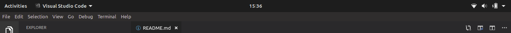
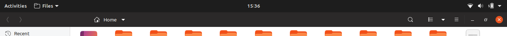
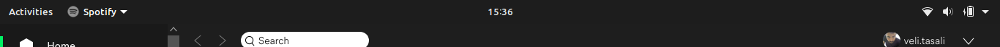

# GTK Title Bar - Remove Title Bar for non-GTK Software
- This extension simply removes title bar on apps like Spotify and Qt5 apps when you maximize the windows for them.
- Unlike Unite (another extension with similar functionality), this does not remove window buttons for GTK apps.
- Makes the minimal change on your system's default behaviour.
- Supports GNOME 3.32 and 3.34 (for 3.28-3.30 support use the versions 3 and below)
- This work here is hardfork of [unite-shell](https://github.com/hardpixel/unite-shell) extension. 

# Screenshots

# Installation

## From https://extensions.gnome.org

1. Go to https://extensions.gnome.org/extension/1732/gtk-title-bar/
2. Install and Enable.

## From Github

1. Download the latest release from 'Releases' page.
2. Extract the folder into `~/.local/share/gnome-shell/extensions`.
3. Do `Alt-F2` and  type `restart`. This will restart the GNOME Shell.
4. Install GNOME Tweak Tool if not already installed.
5. Enable `GTK Title Bar` from the `Extensions` section.

## Arch
AUR VCS package available: https://aur.archlinux.org/packages/gnome-shell-extension-gtktitlebar-git/
